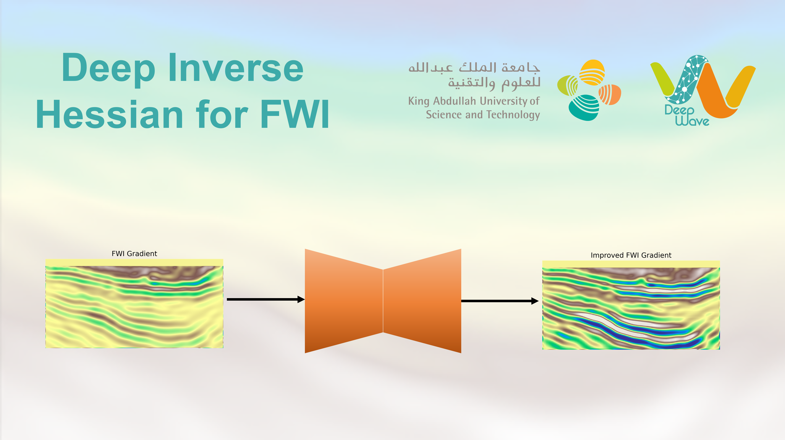

Reproducible material for **A deep learning-based inverse Hessian for Full Waveform Inversion** <br> 
Alfarhan M., Ravasi M., Chen F., Alkhalifah  T.

[Click here](https://kaust.sharepoint.com/:f:/r/sites/M365_Deepwave_Documents/Shared%20Documents/Restricted%20Area/DW0021?csf=1&web=1&e=s7llFZ) to access the Project Report. Authentication to the _Restricted Area_ filespace is required.

## Project structure
This repository is organized as follows:

* :open_file_folder: **deepinvhessian**: python library containing routines for "DeepFWIInvHessian" Full Waveform Inversion Inverse Hessian with Deep Learning;
* :open_file_folder: **data**: folder containing input data;
* :open_file_folder: **notebooks**: set of jupyter notebooks reproducing the experiments in the paper (see below for more details);
* :open_file_folder: **asset**: folder containing logo;

## Supplementary files
Before running the notebooks below, please download the data from [here](https://kaust.sharepoint.com/:f:/r/sites/M365_Deepwave_Documents/Shared%20Documents/Restricted%20Area/DW0021?csf=1&web=1&e=s7llFZ). Then, put all the contents into the /data folder.

## Notebooks
The following notebooks are provided:

- :orange_book: ``Run_Conventional_FWI.ipynb`` : notebook performing conventional FWI (will be updated later).
- :orange_book: ``Run_FWI_Born.ipynb`` : notebook estimating the inverse Hessian with the migration/demigration approach (will be updated later).
- :orange_book: ``Run_FWI_PSF.ipynb`` : notebook estimating the inverse Hessian with the PSFs approach (will be updated later).
- :orange_book: ``FWI-LBFGS-Scipy.ipynb`` : notebook performing FWI with L-BFGS algorithm from the Scipy implementation (will be updated later).
- :orange_book: ``PlottingNotebook.ipynb`` : notebook reproducing the figures in the paper (for the first report).
- :orange_book: ``Marmousi_exp.ipynb`` : notebook performing FWI with the Barzilai-Borwein method and the proposed approach on Marmousi.
- :orange_book: ``Marmousi_LBFGS.ipynb`` : notebook performing FWI with L-BFGS on Marmousi.
- :orange_book: ``Marmousi_create_figures.ipynb`` : notebook to visualize the results of the Marmousi experiments.
- :orange_book: ``Volve_synthetic_exp.ipynb`` : notebook performing FWI with the Barzilai-Borwein method and the proposed approach on Volve synthetic.
- :orange_book: ``Volve_synthetic_LBFGS.ipynb`` : notebook performing FWI with L-BFGS on Volve synthetic.
- :orange_book: ``Volve_synthetic_create_figures.ipynb`` : notebook to visualize the results of the Volve synthetic experiments.
- :orange_book: ``Volve_exp.ipynb`` : notebook performing FWI with the Barzilai-Borwein method and the proposed approach on Volve.
- :orange_book: ``Volve_LBFGS.ipynb`` : notebook performing FWI with L-BFGS on Volve.
- :orange_book: ``Volve_imaging.ipynb`` : notebook to compute RTM images and extended images for Volve.
- :orange_book: ``Volve_create_figures.ipynb`` : notebook to visualize the results of the Volve experiments.

## Getting started
To ensure reproducibility of the results, we suggest using the `environment.yml` file when creating an environment.

Simply run:
```
./install_env.sh
```
It will take some time, if at the end you see the word `Done!` on your terminal you are ready to go. Activate the environment by typing:
```
conda activate deepinvhessian
```

After that you can simply install your package:
```
pip install .
```
or in developer mode:
```
pip install -e .
```


**Disclaimer:** All experiments have been carried on a Intel(R) Xeon(R) CPU @ 3.90GHz equipped with a single NVIDIA GEForce RTX 3090 GPU. Different environment 
configurations may be required for different combinations of workstation and GPU.

## Cite Us
DW0021 - A deep learning-based inverse Hessian for Full Waveform Inversion, 2023.
